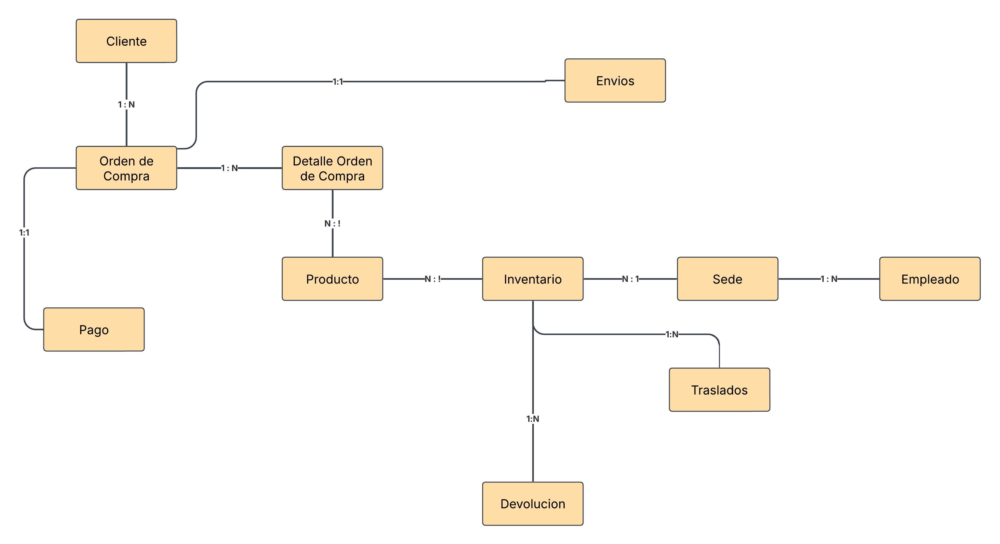
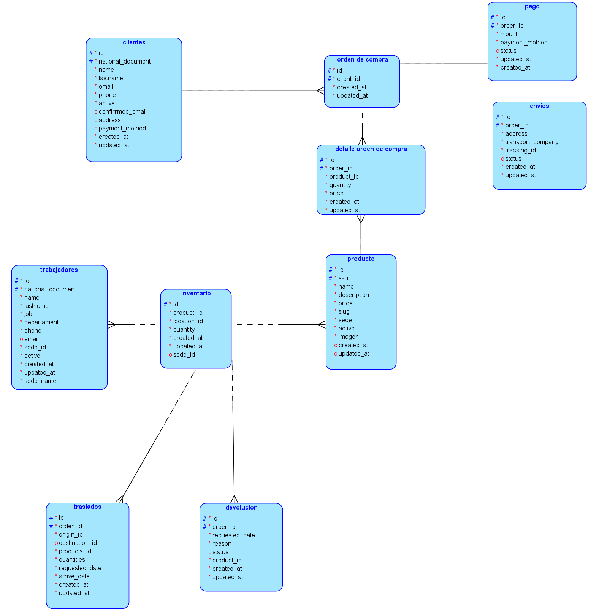
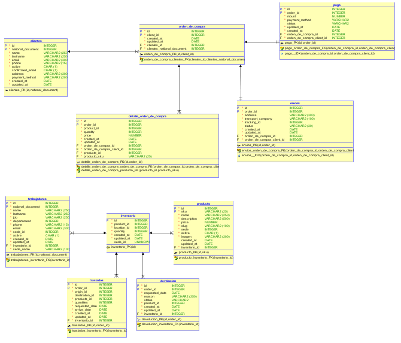
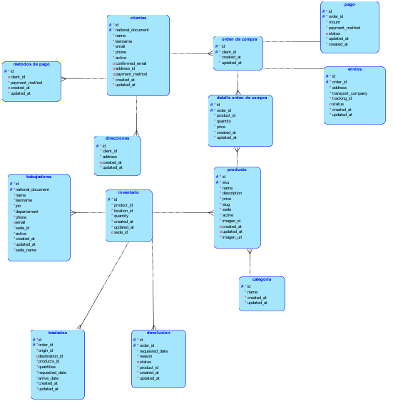
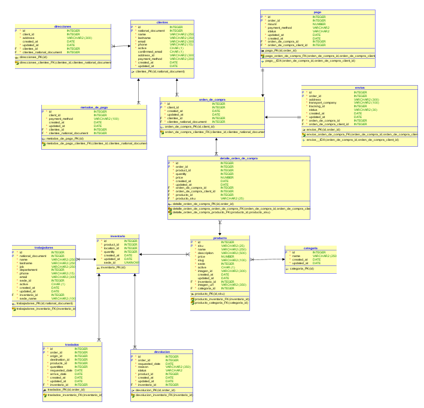
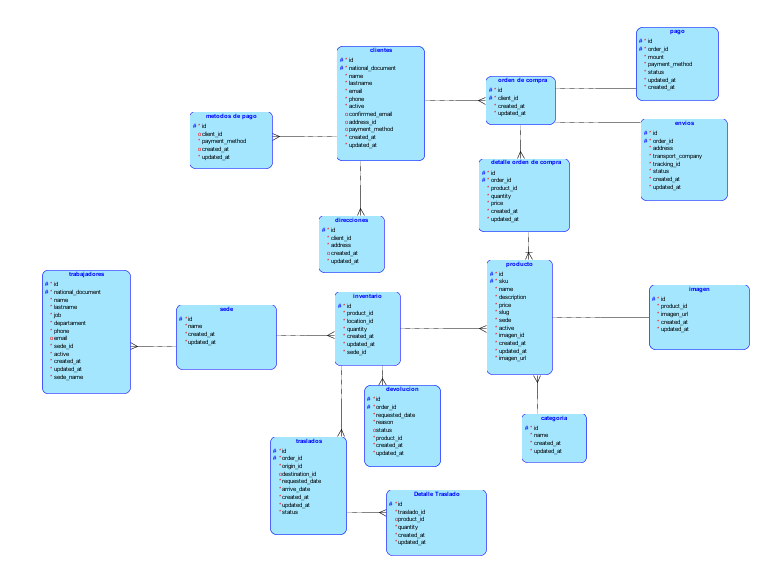
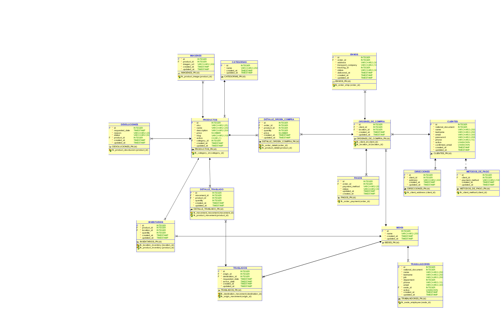

# <h1 align="center">Proyecto 01</h1>

<div align="center">
📕 Sistemas de Bases de Datos 1
</div>
<div align="center"> 🏛 Universidad de San Carlos de Guatemala</div>
<div align="center"> 📆 Primer Semestre 2025</div>
<div align="center">📎 Yania Eszter Dávid </div>
<div align="center"> 🖋️ 202010175 </div>

---


## Descripción del proyecto

 Este proyecto tiene como objetivo el diseño y desarrollo de una base de datos relacional optimizada y normalizada para un centro de ventas en línea de gran escala.

La base de datos estará diseñada bajo los principios de integridad referencial y normalización, garantizando el almacenamiento y procesamiento eficiente de grandes volúmenes de información. Para ello, se definirán entidades clave como:

- **Usuarios** (clientes y administradores del sistema).
- **Trabajadores** (empleados encargados de la gestión operativa).
- **Productos** (inventario disponible para la venta).
- **Órdenes de compra** (transacciones realizadas por los clientes).
- **Pagos** (procesamiento y validación de transacciones financieras).
- **Envíos** (gestión de la logística y distribución).
- **Devoluciones** (mecanismos para el procesamiento de reembolsos y cambios).
- **Traslados de productos** (movimientos internos de inventario entre almacenes o centros de distribución).

Además, el sistema deberá permitir la incorporación automatizada de datos mediante dos mecanismos principales:

1. **Carga masiva** a través de archivos en formato CSV, facilitando la migración y actualización de grandes volúmenes de información.
2. **API de integración**, que posibilite la comunicación con plataformas externas y la actualización en tiempo real de los datos del sistema.

Este enfoque garantizará un sistema escalable, flexible y capaz de adaptarse a las necesidades operativas de un comercio electrónico de gran alcance.

---

## Diseño Sin Normalizar

### Modelo Conceptual



Modelo Conceptual sin Normalizar

### Modelo Lógico



Modelo Lógico sin Normalizar

### Modelo Físico



Modelo Físico sin Normalizar

---

## Normalización

### Primera Forma Normal (1FN)

---

##### Tabla: `clientes`

| Clientes             |
|------------------|
| id              |
| national_document |
| name            |
| lastname        |
| email          |
| phone          |
| active         |
| confirmed_email |
| address        |
| payment_method |
| created_at     |
| updated_at     |

 `clientes (1FN)`
| Clientes             |
|------------------|
| id              |
| national_document |
| name            |
| lastname        |
| email          |
| phone          |
| active         |
| confirmed_email |
| created_at     |
| updated_at     |

 `Direccciones (1FN)`
| Direcciones             |
|------------------|
| id              |
| client_id |
| address            |
| created_at     |
| updated_at     |

 `Métodos de Pago (1FN)`
| Métodos de Pago            |
|------------------|
| id              |
| client_id |
| payment_method            |
| created_at     |
| updated_at     |

---

#### Tabla: `orden_de_compra`

| Orden_de_compra       |
|------------|
| id         |
| client_id  |
| created_at |
| updated_at |
 

 `orden_de_compra (1FN)`

| Orden_de_compra       |
|------------|
| id         |
| client_id  |
| created_at |
| updated_at |

Esta tabla no presenta atributos con varios valores

---

#### Tabla: `detalle_orden_de_compra`

| detalle_orden_de_compra      |
|-----------|
| id        |
| order_id  |
| product_id |
| quantity  |
| price     |
| created_at |
| updated_at |


`detalle_orden_de_compra (1FN)`

| detalle_orden_de_compra      |
|-----------|
| id        |
| order_id  |
| product_id |
| quantity  |
| price     |
| created_at |
| updated_at |

Esta tabla no presenta atributos con varios valores

---

#### Tabla: `pago`

| pago         |
|--------------|
| id          |
| order_id    |
| mount       |
| payment_method |
| status      |
| created_at  |
| updated_at  |

`pago (1FN)`

| pago         |
|--------------|
| id          |
| order_id    |
| mount       |
| payment_method |
| status      |
| created_at  |
| updated_at  |

Esta tabla no presenta atributos con varios valores

---

#### Tabla: `envios`

| envios             |
|------------------|
| id              |
| order_id        |
| address        |
| transport_company |
| tracking_id    |
| status         |
| created_at     |
| updated_at     |

`envios (1FN)`

| envios             |
|------------------|
| id              |
| order_id        |
| address        |
| transport_company |
| tracking_id    |
| status         |
| created_at     |
| updated_at     |

Esta tabla no presenta atributos con varios valores


---

#### Tabla: `producto`

| producto       |
|------------|
| id         |
| sku        |
| name       |
| description |
| price      |
| slug       |
| active     |
| imagen_id     |
| imagen_url     |
| categoria |
| created_at |
| updated_at |

`producto (1FN)`

| producto       |
|------------|
| id         |
| sku        |
| name       |
| description |
| price      |
| slug       |
| active     |
| imagen_id     |
| imagen_url     |
| categoria_id |
| created_at |
| updated_at |

`categoria (1FN)`

| categoria       |
|------------|
| id         |
| name       |
| created_at |
| updated_at |

---

#### Tabla: `trabajadores`

| trabajadores           |
|---------------|
| id            |
| national_document |
| name          |
| lastname      |
| job          |
| department   |
| phone        |
| email        |
| sede_id      |
| sede_name    |
| active       |
| created_at   |
| updated_at   |

`trabajadores (1FN)`

| trabajadores           |
|---------------|
| id            |
| national_document |
| name          |
| lastname      |
| job          |
| department   |
| phone        |
| email        |
| sede_id      |
| sede_name    |
| active       |
| created_at   |
| updated_at   |


Esta tabla no presenta atributos con varios valores


---

#### Tabla: `inventario`

| inventario       |
|------------|
| id         |
| product_id |
| location_id |
| quantity   |
| created_at |
| updated_at |
| sede_id    |

`inventario (1FN)`

| inventario       |
|------------|
| id         |
| product_id |
| location_id |
| quantity   |
| created_at |
| updated_at |
| sede_id    |


Esta tabla no presenta atributos con varios valores


---

#### Tabla: `traslados`

| traslados        |
|------------|
| id         |
| order_id   |
| origin_id  |
| destination_id |
| products_id |
| status     |
| requested_date |
| arrive_date |
| created_at |
| updated_at |

`traslados (1FN)`

| traslados        |
|------------|
| id         |
| order_id   |
| origin_id  |
| destination_id |
| products_id |
| status     |
| requested_date |
| arrive_date |
| created_at |
| updated_at |

Esta tabla no presenta atributos con varios valores


---

#### Tabla: `devolucion`

| devolucion        |
|------------|
| id         |
| order_id   |
| request_date |
| reason     |
| status     |
| product_id |
| created_at |
| updated_at |

`devolucion (1FN)`

| devolucion        |
|------------|
| id         |
| order_id   |
| request_date |
| reason     |
| status     |
| product_id |
| created_at |
| updated_at |


---

##### Modelo Lógico 1FN



Modelo Lógico 1FN

##### Modelo Físico 1FN



Modelo Físico 1FN

---

### Segunda Forma Normal (2FN)

* Se omite copiar las tablas nuevamente si no se ven afectadas 

---

#### Tabla: `Cliente`
No presenta valores que dependan de otro id diferente a la Primary Key

---

#### Tabla: `Direcciones`
No presenta valores que dependan de otro id diferente a la Primary Key

---

#### Tabla: `Método de Pago`
No presenta valores que dependan de otro id diferente a la Primary Key

---

#### Tabla: `Orden de Compra`
No presenta valores que dependan de otro id diferente a la Primary Key

---

#### Tabla: `Pago`
No presenta valores que dependan de otro id diferente a la Primary Key

---

#### Tabla: `Detalle Orden de Compra`
No presenta valores que dependan de otro id diferente a la Primary Key

---

#### Tabla: `Envios`
No presenta valores que dependan de otro id diferente a la Primary Key

---

#### Tabla: `Inventario`
No presenta valores que dependan de otro id diferente a la Primary Key

---

#### Tabla: `Devolución`
No presenta valores que dependan de otro id diferente a la Primary Key

---

#### Tabla:  `producto`

| producto       |
|------------|
| id         |
| sku        |
| name       |
| description |
| price      |
| slug       |
| active     |
| imagen_id     |
| imagen_url     |
| categoria_id |
| created_at |
| updated_at |

`categoria`

| categoria       |
|------------|
| id         |
| name       |
| created_at |
| updated_at |


 `producto (2FN)`

| producto       |
|------------|
| id         |
| sku        |
| name       |
| description |
| price      |
| slug       |
| active     |
| imagen_id     |
| categoria_id |
| created_at |
| updated_at |

`Imagen (2FN)`

| Imagen       |
|------------|
| id         |
| product_id       |
| imagen_url |
| created_at |
| updated_at |

---

#### Tabla: `traslados`

| traslados        |
|------------|
| id         |
| order_id   |
| origin_id  |
| destination_id |
| products_id |
| status     |
| requested_date |
| arrive_date |
| created_at |
| updated_at |

`traslados (2FN)`

| traslados        |
|------------|
| id         |
| order_id   |
| origin_id  |
| destination_id |
| status     |
| requested_date |
| arrive_date |
| created_at |
| updated_at |

`Detalle Traslados (2FN)`

| Detalle Traslados        |
|------------|
| id         |
| traslado_id   |
| products_id |
| quantity |
| created_at |
| updated_at |

---

#### Tabla: `trabajadores`

| trabajadores           |
|---------------|
| id            |
| national_document |
| name          |
| lastname      |
| job          |
| department   |
| phone        |
| email        |
| sede_id      |
| sede_name    |
| active       |
| created_at   |
| updated_at   |


`trabajadores (2FN)`

| trabajadores           |
|---------------|
| id            |
| national_document |
| name          |
| lastname      |
| job          |
| department   |
| phone        |
| email        |
| sede_id      |
| active       |
| created_at   |
| updated_at   |


`sede (2FN)`

| sede           |
|---------------|
| id            |
| name          |
| created_at   |
| updated_at   |


---

## Tercera Forma Normal (3FN)

Después de analizar el diseño de la base de datos, se confirmó que todas las tablas ya cumplen con la **Tercera Forma Normal (3FN)**.

- Todos los atributos dependen únicamente de la clave primaria.  
- No hay dependencias transitivas entre columnas.  
- La estructura está bien organizada, evitando redundancia y manteniendo la integridad de los datos.

Por estas razones, no fue necesario hacer cambios adicionales en esta etapa.


---

## Diseño Final

### Modelo Conceptual


Modelo Conceptual 3FN

### Modelo Lógico



Modelo Lógico 3FN

### Modelo Físico



Modelo Físico 3FN

---

---

## Tablas
#### Tabla: CATEGORIAS

| Nombre de la Columna                | id  | name            | created_at | updated_at |
|-------------------------------------|-----|-----------------|------------|------------|
| **Tipo de Clave**                   | PK  |                 |            |            |
| **No Nula = NN, Única = U**         | NN, U | NN              | NN         | NN         |
| **Tipo de Dato**                    | INTEGER | VARCHAR2(250)   | TIMESTAMP  | TIMESTAMP  |
| **Longitud**                        | -   | 250             | -          | -          |

**Datos de Ejemplo**  

| ID | NAME         | CREATED_AT           | UPDATED_AT           |
|----|-------------|----------------------|----------------------|
| 1  | ELECTRÓNICOS | 2025-03-15 10:00:00 | 2025-03-15 10:00:00 |
| 2  | ROPA         | 2025-03-15 10:00:00 | 2025-03-15 10:00:00 |
| 3  | HOGAR        | 2025-03-15 10:00:00 | 2025-03-15 10:00:00 |
| 4  | LIBROS       | 2025-03-15 10:00:00 | 2025-03-15 10:00:00 |
| 5  | JUGUETES     | 2025-03-15 10:00:00 | 2025-03-15 10:00:00 |
| 6  | ALIMENTOS    | 2025-03-15 10:00:00 | 2025-03-15 10:00:00 |


---

#### Tabla: SEDES

| Nombre de la Columna                | id  | name            | created_at | updated_at |
|-------------------------------------|-----|-----------------|------------|------------|
| **Tipo de Clave**                   | PK  |                 |            |            |
| **No Nula = NN, Única = U**         | NN, U | NN              | NN         | NN         |
| **Tipo de Dato**                    | INTEGER | VARCHAR2(250)   | TIMESTAMP  | TIMESTAMP  |
| **Longitud**                        | -   | 250             | -          | -          |

**Datos de Ejemplo**

| ID | NAME         | CREATED_AT           | UPDATED_AT           |
|----|-------------|----------------------|----------------------|
| 1  | SEDE CENTRAL | 2025-03-15 10:00:00 | 2025-03-15 10:00:00 |
| 2  | SEDE NORTE   | 2025-03-15 10:05:00 | 2025-03-15 10:05:00 |
| 3  | SEDE SUR     | 2025-03-15 10:10:00 | 2025-03-15 10:10:00 |
| 4  | SEDE ESTE    | 2025-03-15 10:15:00 | 2025-03-15 10:15:00 |
| 5  | SEDE OESTE   | 2025-03-15 10:20:00 | 2025-03-15 10:20:00 |
| 6  | SEDE CENTRO  | 2025-03-15 10:25:00 | 2025-03-15 10:25:00 |


---

#### Tabla: CLIENTES

| Nombre de la Columna                | id  | national_document | name            | lastname        | email           | password        | phone          | active | confirmed_email | created_at | updated_at |
|-------------------------------------|-----|------------------|-----------------|-----------------|-----------------|-----------------|----------------|--------|-----------------|------------|------------|
| **Tipo de Clave**                   | PK  |                  |                 |                 |                 |                 |                |        |                 |            |            |
| **No Nula = NN, Única = U**         | NN, U | NN               | NN              | NN              | NN, U           | NN              | NN             | NN     | NN              | NN         | NN         |
| **Tipo de Dato**                    | INTEGER | INTEGER          | VARCHAR2(250)   | VARCHAR2(250)   | VARCHAR2(300)   | VARCHAR2(255)   | VARCHAR2(15)   | BOOLEAN | BOOLEAN         | TIMESTAMP  | TIMESTAMP  |
| **Longitud**                        | -   | -               | 250            | 250            | 300            | 255            | 15            | -      | -              | -          | -          |


| ID | NATIONAL_DOCUMENT | NAME   | LASTNAME | EMAIL              | PASSWORD   | PHONE         | ACTIVE | CONFIRMED_EMAIL | CREATED_AT           | UPDATED_AT           |
|----|-------------------|--------|----------|--------------------|------------|--------------|--------|-----------------|----------------------|----------------------|
| 1  | 12345678          | JUAN   | PÉREZ    | juan@correo.com    | passJuan   | 300-111-1111 | 1      | 1               | 2025-03-15 10:00:00 | 2025-03-15 10:00:00 |
| 2  | 23456789          | MARÍA  | GÓMEZ    | maria@correo.com   | passMaria  | 300-222-2222 | 1      | 0               | 2025-03-15 10:05:00 | 2025-03-15 10:05:00 |
| 3  | 34567890          | CARLOS | LÓPEZ    | carlos@correo.com  | passClopez | 300-333-3333 | 0      | 1               | 2025-03-15 10:10:00 | 2025-03-15 10:10:00 |
| 4  | 45678901          | ANA    | RUIZ     | ana@correo.com     | passAna    | 300-444-4444 | 1      | 1               | 2025-03-15 10:15:00 | 2025-03-15 10:15:00 |
| 5  | 56789012          | LUIS   | TORRES   | luis@correo.com    | passLuis   | 300-555-5555 | 1      | 1               | 2025-03-15 10:20:00 | 2025-03-15 10:20:00 |
| 6  | 67890123          | ELENA  | ROJAS    | elena@correo.com   | passElena  | 300-666-6666 | 0      | 0               | 2025-03-15 10:25:00 | 2025-03-15 10:25:00 |


---

#### Tabla: PRODUCTOS

| Nombre de la Columna                | id  | sku            | name            | description     | price | slug           | active | category_id | created_at | updated_at |
|-------------------------------------|-----|---------------|-----------------|-----------------|-------|---------------|--------|------------|------------|------------|
| **Tipo de Clave**                   | PK  |               |                 |                 |       |               |        | FK         |            |            |
| **No Nula = NN, Única = U**         | NN, U | NN, U          | NN              | NN              | NN    | NN            | NN     | NN         | NN         | NN         |
| **Tipo de Dato**                    | INTEGER | VARCHAR2(25)   | VARCHAR2(250)   | VARCHAR2(500)   | NUMBER | VARCHAR2(100) | CHAR(1) | INTEGER    | TIMESTAMP  | TIMESTAMP  |
| **Longitud**                        | -   | 25            | 250            | 500            | -     | 100           | 1      | -          | -          | -          |

**Datos de Ejemplo**

| ID | SKU       | NAME               | DESCRIPTION                 | PRICE  | SLUG                   | ACTIVE | CATEGORY_ID | CREATED_AT           | UPDATED_AT           |
|----|----------|--------------------|-----------------------------|--------|------------------------|--------|------------|----------------------|----------------------|
| 1  | ELEC-001  | SMARTPHONE        | TELÉFONO INTELIGENTE        | 500.00 | smartphone-android     | Y      | 1          | 2025-03-15 10:00:00 | 2025-03-15 10:00:00 |
| 2  | ELEC-002  | LAPTOP            | PORTÁTIL DE 15 PULGADAS     | 1200.00| laptop-15-pulgadas     | Y      | 1          | 2025-03-15 10:05:00 | 2025-03-15 10:05:00 |
| 3  | ROPA-001  | CAMISETA          | CAMISETA DE ALGODÓN UNISEX  | 15.00  | camiseta-algodon       | Y      | 2          | 2025-03-15 10:10:00 | 2025-03-15 10:10:00 |
| 4  | HOG-001   | SARTÉN            | SARTÉN ANTIADHERENTE        | 25.00  | sarten-antiadherente   | N      | 3          | 2025-03-15 10:15:00 | 2025-03-15 10:15:00 |
| 5  | LIB-001   | LIBRO COCINA      | RECETAS DE COCINA FÁCILES   | 10.00  | libro-cocina-facil     | Y      | 4          | 2025-03-15 10:20:00 | 2025-03-15 10:20:00 |
| 6  | JUG-001   | MUÑECO DE ACCIÓN  | FIGURA COLECCIONABLE        | 30.00  | muneco-de-accion       | Y      | 5          | 2025-03-15 10:25:00 | 2025-03-15 10:25:00 |


---

#### Tabla: ORDENES_DE_COMPRA

| Nombre de la Columna                | id  | client_id | location_id | created_at | updated_at |
|-------------------------------------|-----|----------|------------|------------|------------|
| **Tipo de Clave**                   | PK  | FK       | FK         |            |            |
| **No Nula = NN, Única = U**         | NN, U | NN       | NN         | NN         | NN         |
| **Tipo de Dato**                    | INTEGER | INTEGER | INTEGER    | TIMESTAMP  | TIMESTAMP  |
| **Longitud**                        | -   | -       | -          | -          | -          |

**Datos de Ejemplo**

| ID | CLIENT_ID | LOCATION_ID | CREATED_AT           | UPDATED_AT           |
|----|----------|-------------|----------------------|----------------------|
| 1  | 1        | 1           | 2025-03-15 10:00:00 | 2025-03-15 10:00:00 |
| 2  | 2        | 2           | 2025-03-15 10:05:00 | 2025-03-15 10:05:00 |
| 3  | 1        | 3           | 2025-03-15 10:10:00 | 2025-03-15 10:10:00 |
| 4  | 3        | 2           | 2025-03-15 10:15:00 | 2025-03-15 10:15:00 |
| 5  | 5        | 1           | 2025-03-15 10:20:00 | 2025-03-15 10:20:00 |
| 6  | 4        | 4           | 2025-03-15 10:25:00 | 2025-03-15 10:25:00 |


---

#### Tabla: DIRECCIONES

| Nombre de la Columna                | id  | client_id | address        | created_at | updated_at |
|-------------------------------------|-----|----------|----------------|------------|------------|
| **Tipo de Clave**                   | PK  | FK       |                |            |            |
| **No Nula = NN, Única = U**         | NN, U | NN       | NN             | NN         | NN         |
| **Tipo de Dato**                    | INTEGER | INTEGER | VARCHAR2(300)  | TIMESTAMP  | TIMESTAMP  |
| **Longitud**                        | -   | -       | 300            | -          | -          |

**Datos de Ejemplo**

| ID | CLIENT_ID | ADDRESS                      | CREATED_AT           | UPDATED_AT           |
|----|----------|------------------------------|----------------------|----------------------|
| 1  | 1        | CALLE 123, CIUDAD A          | 2025-03-15 10:00:00 | 2025-03-15 10:00:00 |
| 2  | 2        | AV. PRINCIPAL 45, CIUDAD B   | 2025-03-15 10:05:00 | 2025-03-15 10:05:00 |
| 3  | 3        | CRA. 56 #78-90, CIUDAD C     | 2025-03-15 10:10:00 | 2025-03-15 10:10:00 |
| 4  | 1        | TRANSV. 12 #34-56, CIUDAD D  | 2025-03-15 10:15:00 | 2025-03-15 10:15:00 |
| 5  | 5        | BARRIO CENTRAL, CIUDAD E     | 2025-03-15 10:20:00 | 2025-03-15 10:20:00 |
| 6  | 4        | ZONA INDUSTRIAL, CIUDAD F    | 2025-03-15 10:25:00 | 2025-03-15 10:25:00 |


---

#### Tabla: INVENTARIOS

| Nombre de la Columna                | id  | product_id | location_id | quantity | created_at | updated_at |
|-------------------------------------|-----|-----------|------------|----------|------------|------------|
| **Tipo de Clave**                   | PK  | FK        | FK         |          |            |            |
| **No Nula = NN, Única = U**         | NN, U | NN        | NN         | NN       | NN         | NN         |
| **Tipo de Dato**                    | INTEGER | INTEGER   | INTEGER    | INTEGER  | TIMESTAMP  | TIMESTAMP  |
| **Longitud**                        | -   | -        | -          | -        | -          | -          |

**Datos de Ejemplo**

| ID | PRODUCT_ID | LOCATION_ID | QUANTITY | CREATED_AT           | UPDATED_AT           |
|----|-----------|-------------|----------|----------------------|----------------------|
| 1  | 1         | 1           | 10       | 2025-03-15 10:00:00 | 2025-03-15 10:00:00 |
| 2  | 2         | 2           | 5        | 2025-03-15 10:05:00 | 2025-03-15 10:05:00 |
| 3  | 3         | 3           | 20       | 2025-03-15 10:10:00 | 2025-03-15 10:10:00 |
| 4  | 4         | 1           | 8        | 2025-03-15 10:15:00 | 2025-03-15 10:15:00 |
| 5  | 5         | 2           | 15       | 2025-03-15 10:20:00 | 2025-03-15 10:20:00 |
| 6  | 6         | 3           | 12       | 2025-03-15 10:25:00 | 2025-03-15 10:25:00 |


---

#### Tabla: DETALLE_ORDEN_COMPRA

| Nombre de la Columna                | id  | order_id | product_id | quantity | price | created_at | updated_at |
|-------------------------------------|-----|---------|-----------|----------|-------|------------|------------|
| **Tipo de Clave**                   | PK  | FK      | FK        |          |       |            |            |
| **No Nula = NN, Única = U**         | NN, U | NN      | NN        | NN       | NN    | NN         | NN         |
| **Tipo de Dato**                    | INTEGER | INTEGER | INTEGER   | INTEGER  | NUMBER | TIMESTAMP  | TIMESTAMP  |
| **Longitud**                        | -   | -      | -        | -        | -     | -          | -          |

**Datos de Ejemplo**

| ID | ORDER_ID | PRODUCT_ID | QUANTITY | PRICE   | CREATED_AT           | UPDATED_AT           |
|----|---------|-----------|----------|---------|----------------------|----------------------|
| 1  | 1       | 1         | 2        | 1000.00 | 2025-03-15 10:00:00 | 2025-03-15 10:00:00 |
| 2  | 1       | 3         | 1        | 15.00   | 2025-03-15 10:00:00 | 2025-03-15 10:00:00 |
| 3  | 2       | 2         | 1        | 1200.00 | 2025-03-15 10:05:00 | 2025-03-15 10:05:00 |
| 4  | 3       | 4         | 1        | 25.00   | 2025-03-15 10:10:00 | 2025-03-15 10:10:00 |
| 5  | 4       | 3         | 2        | 30.00   | 2025-03-15 10:15:00 | 2025-03-15 10:15:00 |
| 6  | 5       | 1         | 1        | 500.00  | 2025-03-15 10:20:00 | 2025-03-15 10:20:00 |


---

#### Tabla: METODOS_DE_PAGO

| Nombre de la Columna                | id  | client_id | payment_method   | created_at | updated_at |
|-------------------------------------|-----|----------|------------------|------------|------------|
| **Tipo de Clave**                   | PK  | FK       |                  |            |            |
| **No Nula = NN, Única = U**         | NN, U |         | NN               |            | NN         |
| **Tipo de Dato**                    | INTEGER | INTEGER | VARCHAR2(100)    | TIMESTAMP  | TIMESTAMP  |
| **Longitud**                        | -   | -       | 100              | -          | -          |

**Datos de Ejemplo**

| ID | CLIENT_ID | PAYMENT_METHOD   | CREATED_AT           | UPDATED_AT           |
|----|----------|------------------|----------------------|----------------------|
| 1  | 1        | TARJETA CRÉDITO  | 2025-03-15 10:00:00 | 2025-03-15 10:00:00 |
| 2  | 2        | PAYPAL           | 2025-03-15 10:05:00 | 2025-03-15 10:05:00 |
| 3  | 3        | EFECTIVO         | 2025-03-15 10:10:00 | 2025-03-15 10:10:00 |
| 4  | 4        | TARJETA DÉBITO   | 2025-03-15 10:15:00 | 2025-03-15 10:15:00 |
| 5  | 5        | CRIPTOMONEDA     | 2025-03-15 10:20:00 | 2025-03-15 10:20:00 |
| 6  | 1        | TRANSFERENCIA    | 2025-03-15 10:25:00 | 2025-03-15 10:25:00 |


---

#### Tabla: PAGOS

| Nombre de la Columna                | id  | order_id | payment_method | status        | updated_at | created_at |
|-------------------------------------|-----|----------|---------------|---------------|------------|------------|
| **Tipo de Clave**                   | PK  | FK       |               |               |            |            |
| **No Nula = NN, Única = U**         | NN, U | NN       | NN            | NN            | NN         | NN         |
| **Tipo de Dato**                    | INTEGER | INTEGER | VARCHAR2(50)  | VARCHAR2(50)  | TIMESTAMP  | TIMESTAMP  |
| **Longitud**                        | -   | -       | 50            | 50            | -          | -          |

**Datos de Ejemplo**

| ID | ORDER_ID | PAYMENT_METHOD   | STATUS    | UPDATED_AT           | CREATED_AT           |
|----|---------|------------------|----------|----------------------|----------------------|
| 1  | 1       | TARJETA CRÉDITO  | APROBADO  | 2025-03-15 10:00:00 | 2025-03-15 10:00:00 |
| 2  | 2       | PAYPAL           | PENDIENTE | 2025-03-15 10:05:00 | 2025-03-15 10:05:00 |
| 3  | 3       | EFECTIVO         | APROBADO  | 2025-03-15 10:10:00 | 2025-03-15 10:10:00 |
| 4  | 4       | TARJETA DÉBITO   | FALLIDO   | 2025-03-15 10:15:00 | 2025-03-15 10:15:00 |
| 5  | 5       | CRIPTOMONEDA     | PENDIENTE | 2025-03-15 10:20:00 | 2025-03-15 10:20:00 |
| 6  | 6       | TRANSFERENCIA    | APROBADO  | 2025-03-15 10:25:00 | 2025-03-15 10:25:00 |


---

#### Tabla: ENVIOS

| Nombre de la Columna                | id  | order_id | address        | transport_company | tracking_id | status        | delivered_at | created_at | updated_at |
|-------------------------------------|-----|---------|----------------|-------------------|------------|---------------|-------------|------------|------------|
| **Tipo de Clave**                   | PK  | FK      |                |                   |            |               |             |            |            |
| **No Nula = NN, Única = U**         | NN, U | NN      | NN             | NN                | NN         | NN            | NN          | NN         | NN         |
| **Tipo de Dato**                    | INTEGER | INTEGER | VARCHAR2(300)  | VARCHAR2(100)     | INTEGER    | VARCHAR2(30)  | TIMESTAMP   | TIMESTAMP  | TIMESTAMP  |
| **Longitud**                        | -   | -      | 300            | 100               | -          | 30            | -           | -          | -          |

**Datos de Ejemplo**

| ID | ORDER_ID | ADDRESS                   | TRANSPORT_COMPANY | TRACKING_ID | STATUS     | DELIVERED_AT         | CREATED_AT           | UPDATED_AT           |
|----|---------|---------------------------|-------------------|------------|-----------|----------------------|----------------------|----------------------|
| 1  | 1       | CALLE 123, CIUDAD A       | DHL               | 11111      | EN CAMINO | 2025-03-15 10:00:00  | 2025-03-15 10:00:00 | 2025-03-15 10:00:00 |
| 2  | 2       | AV. PRINCIPAL 45, CIUDAD B| FEDEX             | 22222      | PENDIENTE | 2025-03-15 10:05:00  | 2025-03-15 10:05:00 | 2025-03-15 10:05:00 |
| 3  | 3       | CRA. 56 #78-90, CIUDAD C  | UPS               | 33333      | EN CAMINO | 2025-03-15 10:10:00  | 2025-03-15 10:10:00 | 2025-03-15 10:10:00 |
| 4  | 4       | TRANSV. 12 #34-56, C. D   | SERVIENTREGA      | 44444      | ENTREGADO | 2025-03-15 10:15:00  | 2025-03-15 10:15:00 | 2025-03-15 10:15:00 |
| 5  | 5       | BARRIO CENTRAL, CIUDAD E  | DHL               | 55555      | PENDIENTE | 2025-03-15 10:20:00  | 2025-03-15 10:20:00 | 2025-03-15 10:20:00 |
| 6  | 6       | ZONA INDUSTRIAL, CIUDAD F | FEDEX             | 66666      | EN CAMINO | 2025-03-15 10:25:00  | 2025-03-15 10:25:00 | 2025-03-15 10:25:00 |


---

#### Tabla: DEVOLUCIONES

| Nombre de la Columna                | id  | requested_date | reason         | status         | product_id | created_at | updated_at |
|-------------------------------------|-----|---------------|----------------|----------------|-----------|-----------|-----------|
| **Tipo de Clave**                   | PK  |               |                |                | FK        |           |           |
| **No Nula = NN, Única = U**         | NN, U | NN            | NN             | NN             | NN        | NN        | NN        |
| **Tipo de Dato**                    | INTEGER | TIMESTAMP     | VARCHAR2(350)  | VARCHAR2(50)   | INTEGER   | TIMESTAMP | TIMESTAMP |
| **Longitud**                        | -   | -            | 350            | 50             | -         | -         | -         |

**Datos de Ejemplo**

| ID | REQUESTED_DATE        | REASON                       | STATUS      | PRODUCT_ID | CREATED_AT           | UPDATED_AT           |
|----|-----------------------|------------------------------|------------|-----------|----------------------|----------------------|
| 1  | 2025-03-15 10:00:00   | PRODUCTO DEFECTUOSO         | PROCESANDO | 1         | 2025-03-15 10:00:00 | 2025-03-15 10:00:00 |
| 2  | 2025-03-15 10:05:00   | TAMAÑO EQUIVOCADO           | APROBADA   | 3         | 2025-03-15 10:05:00 | 2025-03-15 10:05:00 |
| 3  | 2025-03-15 10:10:00   | FALTAN PIEZAS               | RECHAZADA  | 4         | 2025-03-15 10:10:00 | 2025-03-15 10:10:00 |
| 4  | 2025-03-15 10:15:00   | NO ERA EL PRODUCTO PEDIDO   | PROCESANDO | 5         | 2025-03-15 10:15:00 | 2025-03-15 10:15:00 |
| 5  | 2025-03-15 10:20:00   | LLEGÓ DAÑADO                | APROBADA   | 2         | 2025-03-15 10:20:00 | 2025-03-15 10:20:00 |
| 6  | 2025-03-15 10:25:00   | NO ME GUSTÓ EL COLOR        | RECHAZADA  | 6         | 2025-03-15 10:25:00 | 2025-03-15 10:25:00 |


---

#### Tabla: TRABAJADORES

| Nombre de la Columna                | id  | national_document | name            | lastname        | job            | deparment | phone        | email          | sede_id | active | created_at | updated_at |
|-------------------------------------|-----|------------------|-----------------|-----------------|----------------|----------|-------------|---------------|--------|--------|-----------|-----------|
| **Tipo de Clave**                   | PK  |                  |                 |                 |                |          |             |               | FK     |        |           |           |
| **No Nula = NN, Única = U**         | NN, U | NN               | NN              | NN              | NN             | NN       | NN          |               | NN     | NN     | NN        | NN        |
| **Tipo de Dato**                    | INTEGER | INTEGER          | VARCHAR2(250)   | VARCHAR2(250)   | VARCHAR2(250)  | INTEGER  | VARCHAR2(15) | VARCHAR2(300) | INTEGER | BOOLEAN | TIMESTAMP | TIMESTAMP |
| **Longitud**                        | -   | -               | 250            | 250            | 250           | -       | 15          | 300           | -      | -      | -         | -         |

**Datos de Ejemplo**

| ID | NATIONAL_DOCUMENT | NAME    | LASTNAME | JOB            | DEPARMENT | PHONE         | EMAIL             | SEDE_ID | ACTIVE | CREATED_AT           | UPDATED_AT           |
|----|-------------------|--------|----------|---------------|----------|--------------|-------------------|--------|--------|----------------------|----------------------|
| 1  | 11111111          | PEDRO  | SÁNCHEZ  | ADMINISTRADOR | 1        | 300-777-7777 | pedro@sede.com    | 1      | 1      | 2025-03-15 10:00:00 | 2025-03-15 10:00:00 |
| 2  | 22222222          | LUCÍA  | VARGAS   | CONTADORA     | 2        | 300-888-8888 | lucia@sede.com    | 2      | 1      | 2025-03-15 10:05:00 | 2025-03-15 10:05:00 |
| 3  | 33333333          | JORGE  | DÍAZ     | VENDEDOR      | 3        | 300-999-9999 | jorge@sede.com    | 3      | 1      | 2025-03-15 10:10:00 | 2025-03-15 10:10:00 |
| 4  | 44444444          | MARTA  | GÓMEZ    | SUPERVISOR    | 1        | 300-000-0000 | marta@sede.com    | 1      | 1      | 2025-03-15 10:15:00 | 2025-03-15 10:15:00 |
| 5  | 55555555          | SAMUEL | TORRES   | LOGÍSTICA     | 4        | 300-111-2222 | samuel@sede.com   | 4      | 0      | 2025-03-15 10:20:00 | 2025-03-15 10:20:00 |
| 6  | 66666666          | PAULA  | ROJAS    | RECEPCIÓN     | 2        | 300-222-1111 | paula@sede.com    | 2      | 1      | 2025-03-15 10:25:00 | 2025-03-15 10:25:00 |


---

#### Tabla: DETALLE_TRASLADO

| Nombre de la Columna                | id  | movement_id | product_id | quantity | created_at | updated_at |
|-------------------------------------|-----|------------|-----------|----------|------------|------------|
| **Tipo de Clave**                   | PK  | FK         | FK        |          |            |            |
| **No Nula = NN, Única = U**         | NN, U | NN         | NN        | NN       | NN         | NN         |
| **Tipo de Dato**                    | INTEGER | INTEGER    | INTEGER   | INTEGER  | TIMESTAMP  | TIMESTAMP  |
| **Longitud**                        | -   | -         | -        | -        | -          | -          |

**Datos de Ejemplo**

| ID | MOVEMENT_ID | PRODUCT_ID | QUANTITY | CREATED_AT           | UPDATED_AT           |
|----|------------|-----------|----------|----------------------|----------------------|
| 1  | 1          | 1         | 10       | 2025-03-15 10:00:00 | 2025-03-15 10:00:00 |
| 2  | 1          | 2         | 5        | 2025-03-15 10:05:00 | 2025-03-15 10:05:00 |
| 3  | 2          | 3         | 3        | 2025-03-15 10:10:00 | 2025-03-15 10:10:00 |
| 4  | 3          | 5         | 2        | 2025-03-15 10:15:00 | 2025-03-15 10:15:00 |
| 5  | 4          | 1         | 1        | 2025-03-15 10:20:00 | 2025-03-15 10:20:00 |
| 6  | 5          | 6         | 4        | 2025-03-15 10:25:00 | 2025-03-15 10:25:00 |


---

#### Tabla: IMAGENES

| Nombre de la Columna                | id  | product_id | imagen_url     | created_at | updated_at |
|-------------------------------------|-----|-----------|----------------|------------|------------|
| **Tipo de Clave**                   | PK  | FK        |                |            |            |
| **No Nula = NN, Única = U**         | NN, U | NN        | NN             | NN         | NN         |
| **Tipo de Dato**                    | INTEGER | INTEGER   | VARCHAR2(300)  | TIMESTAMP  | TIMESTAMP  |
| **Longitud**                        | -   | -        | 300            | -          | -          |

**Datos de Ejemplo**

| ID | PRODUCT_ID | IMAGEN_URL                     | CREATED_AT           | UPDATED_AT           |
|----|-----------|--------------------------------|----------------------|----------------------|
| 1  | 1         | https://example.com/img1.jpg   | 2025-03-15 10:00:00 | 2025-03-15 10:00:00 |
| 2  | 2         | https://example.com/img2.jpg   | 2025-03-15 10:05:00 | 2025-03-15 10:05:00 |
| 3  | 3         | https://example.com/img3.jpg   | 2025-03-15 10:10:00 | 2025-03-15 10:10:00 |
| 4  | 4         | https://example.com/img4.jpg   | 2025-03-15 10:15:00 | 2025-03-15 10:15:00 |
| 5  | 5         | https://example.com/img5.jpg   | 2025-03-15 10:20:00 | 2025-03-15 10:20:00 |
| 6  | 6         | https://example.com/img6.jpg   | 2025-03-15 10:25:00 | 2025-03-15 10:25:00 |

---

#### Tabla: TRASLADOS

| Nombre de la Columna                | id  | origin_id | destination_id | requested_date | arrive_date | created_at | updated_at |
|-------------------------------------|-----|----------|---------------|----------------|------------|-----------|-----------|
| **Tipo de Clave**                   | PK  | FK       | FK            |                |            |           |           |
| **No Nula = NN, Única = U**         | NN, U | NN       | NN            | NN             | NN         | NN        | NN        |
| **Tipo de Dato**                    | INTEGER | INTEGER  | INTEGER       | TIMESTAMP      | TIMESTAMP  | TIMESTAMP | TIMESTAMP |
| **Longitud**                        | -   | -       | -             | -              | -          | -         | -         |

**Datos de Ejemplo**

| ID | ORIGIN_ID | DESTINATION_ID | REQUESTED_DATE       | ARRIVE_DATE          | CREATED_AT           | UPDATED_AT           |
|----|----------|---------------|----------------------|----------------------|----------------------|----------------------|
| 1  | 1        | 2             | 2025-03-15 09:00:00 | 2025-03-15 09:30:00 | 2025-03-15 09:00:00 | 2025-03-15 09:00:00 |
| 2  | 2        | 3             | 2025-03-15 09:10:00 | 2025-03-15 09:40:00 | 2025-03-15 09:10:00 | 2025-03-15 09:10:00 |
| 3  | 3        | 1             | 2025-03-15 09:20:00 | 2025-03-15 09:50:00 | 2025-03-15 09:20:00 | 2025-03-15 09:20:00 |
| 4  | 1        | 4             | 2025-03-15 09:30:00 | 2025-03-15 10:00:00 | 2025-03-15 09:30:00 | 2025-03-15 09:30:00 |
| 5  | 4        | 5             | 2025-03-15 09:40:00 | 2025-03-15 10:10:00 | 2025-03-15 09:40:00 | 2025-03-15 09:40:00 |
| 6  | 5        | 1             | 2025-03-15 09:50:00 | 2025-03-15 10:20:00 | 2025-03-15 09:50:00 | 2025-03-15 09:50:00 |


---

---

## Script de Creación de la Base de Datos

```sql
-- Tabla 1: CATEGORIAS
CREATE TABLE CATEGORIAS (
    id         INTEGER       PRIMARY KEY,
    name       VARCHAR2(250) NOT NULL,
    created_at TIMESTAMP     DEFAULT CURRENT_TIMESTAMP NOT NULL,
    updated_at TIMESTAMP     DEFAULT CURRENT_TIMESTAMP NOT NULL
);

-- Tabla 2: SEDES
CREATE TABLE SEDES (
    id         INTEGER       PRIMARY KEY,
    name       VARCHAR2(250) NOT NULL,
    created_at TIMESTAMP     DEFAULT CURRENT_TIMESTAMP NOT NULL,
    updated_at TIMESTAMP     DEFAULT CURRENT_TIMESTAMP NOT NULL
);

-- Tabla 3: CLIENTES
CREATE TABLE CLIENTES (
    id                INTEGER       PRIMARY KEY,
    national_document INTEGER       NOT NULL,
    name              VARCHAR2(250) NOT NULL,
    lastname          VARCHAR2(250) NOT NULL,
    email             VARCHAR2(300) NOT NULL,
    password          VARCHAR2(255) NOT NULL,
    phone             VARCHAR2(15)  NOT NULL,
    active            BOOLEAN       NOT NULL CHECK (active IN (0, 1)),
    confirmed_email   BOOLEAN       NOT NULL CHECK (confirmed_email IN (0, 1)),
    created_at        TIMESTAMP     DEFAULT CURRENT_TIMESTAMP NOT NULL,
    updated_at        TIMESTAMP     DEFAULT CURRENT_TIMESTAMP NOT NULL
);

-- Tabla 4: PRODUCTOS
CREATE TABLE PRODUCTOS (
    id                               INTEGER       PRIMARY KEY,
    sku                              VARCHAR2(25)  NOT NULL,
    name                             VARCHAR2(250) NOT NULL,
    description                      VARCHAR2(500) NOT NULL,
    price                            NUMBER        NOT NULL,
    slug                             VARCHAR2(100) NOT NULL,
    active                           CHAR(1)       NOT NULL,
    category_id                      INTEGER       NOT NULL,
    created_at                       TIMESTAMP     DEFAULT CURRENT_TIMESTAMP NOT NULL,
    updated_at                       TIMESTAMP     DEFAULT CURRENT_TIMESTAMP NOT NULL,
    CONSTRAINT fk_category_id FOREIGN KEY (category_id) REFERENCES CATEGORIAS (id)
);

-- Tabla 5: ORDENES_DE_COMPRA
CREATE TABLE ORDENES_DE_COMPRA (
    id                         INTEGER   PRIMARY KEY,
    client_id                  INTEGER   NOT NULL,
    location_id                INTEGER   NOT NULL,
    created_at                 TIMESTAMP DEFAULT CURRENT_TIMESTAMP NOT NULL,
    updated_at                 TIMESTAMP DEFAULT CURRENT_TIMESTAMP NOT NULL,
    CONSTRAINT fk_client_id FOREIGN KEY (client_id) REFERENCES CLIENTES (id),
    CONSTRAINT fk_location_id FOREIGN KEY (location_id) REFERENCES SEDES (id)
);

-- Tabla 6: DIRECCIONES
CREATE TABLE DIRECCIONES (
    id                         INTEGER       PRIMARY KEY,
    client_id                  INTEGER       NOT NULL,
    address                    VARCHAR2(300) NOT NULL,
    created_at                 TIMESTAMP     DEFAULT CURRENT_TIMESTAMP,
    updated_at                 TIMESTAMP     DEFAULT CURRENT_TIMESTAMP NOT NULL,
    CONSTRAINT fk_client_address FOREIGN KEY (client_id) REFERENCES CLIENTES (id)
);

-- Tabla 7: INVENTARIOS
CREATE TABLE INVENTARIOS (
    id          INTEGER   PRIMARY KEY,
    product_id  INTEGER   NOT NULL,
    location_id INTEGER   NOT NULL,
    quantity    INTEGER   NOT NULL,
    created_at  TIMESTAMP DEFAULT CURRENT_TIMESTAMP NOT NULL,
    updated_at  TIMESTAMP DEFAULT CURRENT_TIMESTAMP NOT NULL,
    CONSTRAINT fk_product_inventory FOREIGN KEY (product_id) REFERENCES PRODUCTOS (id),
    CONSTRAINT fk_location_inventory FOREIGN KEY (location_id) REFERENCES SEDES (id)
);

-- Tabla 8: DETALLE_ORDEN_COMPRA
CREATE TABLE DETALLE_ORDEN_COMPRA (
    id                        INTEGER   PRIMARY KEY,
    order_id                  INTEGER   NOT NULL,
    product_id                INTEGER   NOT NULL,
    quantity                  INTEGER   NOT NULL,
    price                     NUMBER    NOT NULL,
    created_at                TIMESTAMP DEFAULT CURRENT_TIMESTAMP NOT NULL,
    updated_at                TIMESTAMP DEFAULT CURRENT_TIMESTAMP NOT NULL,
    CONSTRAINT fk_order_detail FOREIGN KEY (order_id) REFERENCES ORDENES_DE_COMPRA (id),
    CONSTRAINT fk_product_detail FOREIGN KEY (product_id) REFERENCES PRODUCTOS (id)
);

-- Tabla 9: METODOS_DE_PAGO
CREATE TABLE METODOS_DE_PAGO (
    id                         INTEGER       PRIMARY KEY,
    client_id                  INTEGER,
    payment_method             VARCHAR2(100) NOT NULL,
    created_at                 TIMESTAMP     DEFAULT CURRENT_TIMESTAMP,
    updated_at                 TIMESTAMP     DEFAULT CURRENT_TIMESTAMP NOT NULL,
    CONSTRAINT fk_client_method FOREIGN KEY (client_id) REFERENCES CLIENTES (id)
);

-- Tabla 10: PAGOS
CREATE TABLE PAGOS (
    id                        INTEGER   PRIMARY KEY,
    order_id                  INTEGER   NOT NULL,
    payment_method            VARCHAR2(50) NOT NULL,
    status                    VARCHAR2(50) NOT NULL,
    updated_at                TIMESTAMP DEFAULT CURRENT_TIMESTAMP NOT NULL,
    created_at                TIMESTAMP DEFAULT CURRENT_TIMESTAMP NOT NULL,
    CONSTRAINT fk_order_payment FOREIGN KEY (order_id) REFERENCES ORDENES_DE_COMPRA (id)
);

-- Tabla 11: ENVIOS
CREATE TABLE ENVIOS (
    id                        INTEGER       PRIMARY KEY,
    order_id                  INTEGER       NOT NULL,
    address                   VARCHAR2(300) NOT NULL,
    transport_company         VARCHAR2(100) NOT NULL,
    tracking_id               INTEGER       NOT NULL,
    status                    VARCHAR2(30)  NOT NULL,
    delivered_at                TIMESTAMP     DEFAULT CURRENT_TIMESTAMP NOT NULL,
    created_at                TIMESTAMP     DEFAULT CURRENT_TIMESTAMP NOT NULL,
    updated_at                TIMESTAMP     DEFAULT CURRENT_TIMESTAMP NOT NULL,
    CONSTRAINT fk_order_ship FOREIGN KEY (order_id) REFERENCES ORDENES_DE_COMPRA (id)
);

-- Tabla 12: DEVOLUCIONES
CREATE TABLE DEVOLUCIONES (
    id             INTEGER   PRIMARY KEY,
    requested_date TIMESTAMP DEFAULT CURRENT_TIMESTAMP NOT NULL,
    reason         VARCHAR2(350) NOT NULL,
    status         VARCHAR2(50)  NOT NULL,
    product_id     INTEGER   NOT NULL,
    created_at     TIMESTAMP DEFAULT CURRENT_TIMESTAMP NOT NULL,
    updated_at     TIMESTAMP DEFAULT CURRENT_TIMESTAMP NOT NULL,
    CONSTRAINT fk_product_devolucion FOREIGN KEY (product_id) REFERENCES PRODUCTOS (id)
);

-- Tabla 13: TRABAJADORES
CREATE TABLE TRABAJADORES (
    id                INTEGER       PRIMARY KEY,
    national_document INTEGER       NOT NULL,
    name              VARCHAR2(250) NOT NULL,
    lastname          VARCHAR2(250) NOT NULL,
    job               VARCHAR2(250) NOT NULL,
    deparment          INTEGER       NOT NULL,
    phone             VARCHAR2(15)  NOT NULL,
    email             VARCHAR2(300),
    sede_id           INTEGER       NOT NULL,
    active            BOOLEAN       NOT NULL CHECK (active IN (0, 1)),
    created_at        TIMESTAMP     DEFAULT CURRENT_TIMESTAMP NOT NULL,
    updated_at        TIMESTAMP     DEFAULT CURRENT_TIMESTAMP NOT NULL,
    CONSTRAINT fk_sede_employee FOREIGN KEY (sede_id) REFERENCES SEDES (id)

);

-- Tabla 14: IMAGENES
CREATE TABLE IMAGENES (
    id           INTEGER       PRIMARY KEY,
    product_id   INTEGER       NOT NULL,
    imagen_url   VARCHAR2(300) NOT NULL,
    created_at   TIMESTAMP     DEFAULT CURRENT_TIMESTAMP NOT NULL,
    updated_at   TIMESTAMP     DEFAULT CURRENT_TIMESTAMP NOT NULL,
   CONSTRAINT fk_product_image FOREIGN KEY (product_id) REFERENCES PRODUCTOS (id)
);

-- Tabla 15: TRASLADOS
CREATE TABLE TRASLADOS (
    id             INTEGER       PRIMARY KEY,
    origin_id      INTEGER       NOT NULL,
    destination_id INTEGER      NOT NULL,
    requested_date TIMESTAMP     NOT NULL,
    arrive_date    TIMESTAMP     NOT NULL,
    created_at     TIMESTAMP     DEFAULT CURRENT_TIMESTAMP NOT NULL,
    updated_at     TIMESTAMP     DEFAULT CURRENT_TIMESTAMP NOT NULL,
    CONSTRAINT fk_origin_movement FOREIGN KEY (origin_id) REFERENCES SEDES (id),
    CONSTRAINT fk_destination_movement FOREIGN KEY (destination_id) REFERENCES SEDES (id)
);

-- Tabla 16: DETALLE_TRASLADO
CREATE TABLE DETALLE_TRASLADO (
    id                 INTEGER   PRIMARY KEY,
    movement_id        INTEGER   NOT NULL,
    product_id         INTEGER   NOT NULL,
    quantity           INTEGER   NOT NULL,
    created_at         TIMESTAMP DEFAULT CURRENT_TIMESTAMP NOT NULL,
    updated_at         TIMESTAMP DEFAULT CURRENT_TIMESTAMP NOT NULL,
    CONSTRAINT fk_movement_movement FOREIGN KEY (movement_id) REFERENCES TRASLADOS (id),
    CONSTRAINT fk_product_movement FOREIGN KEY (product_id) REFERENCES PRODUCTOS (id)
);


```

---

# <h1 align="center">Integración a la Base de Datos</h1>

### Endpoints

Descripción de los endpoints